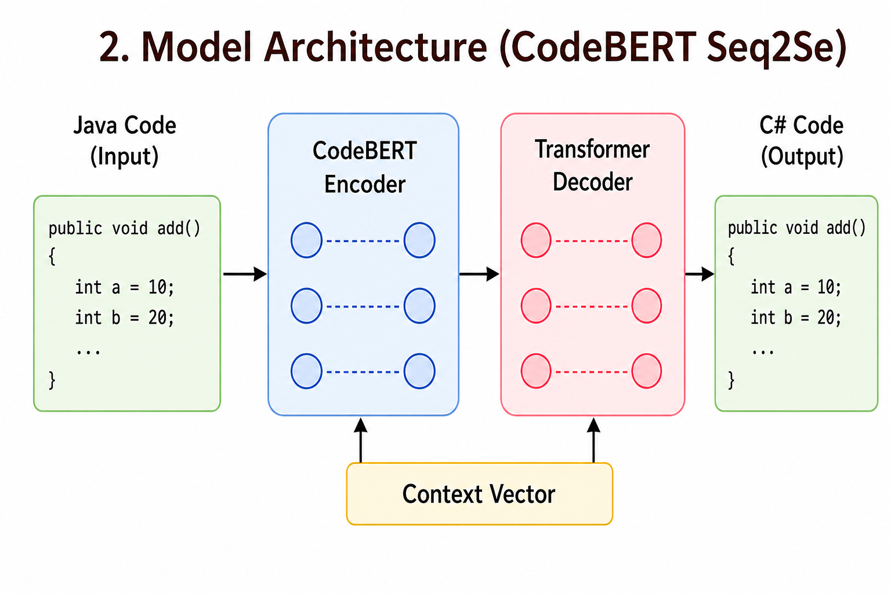
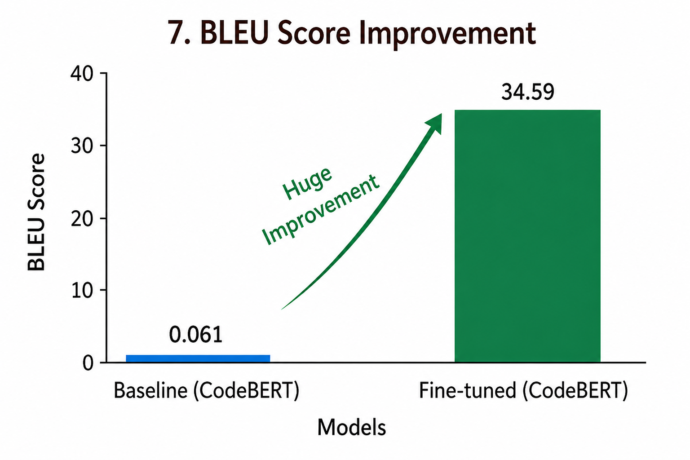
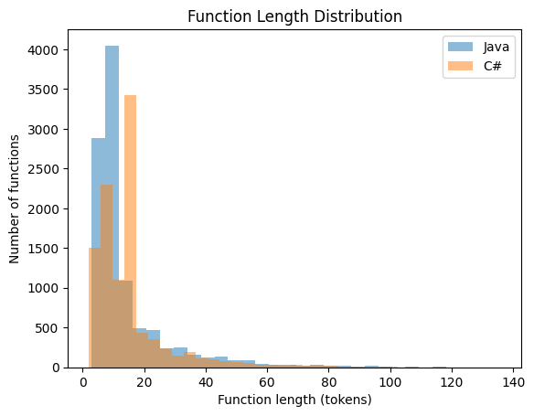
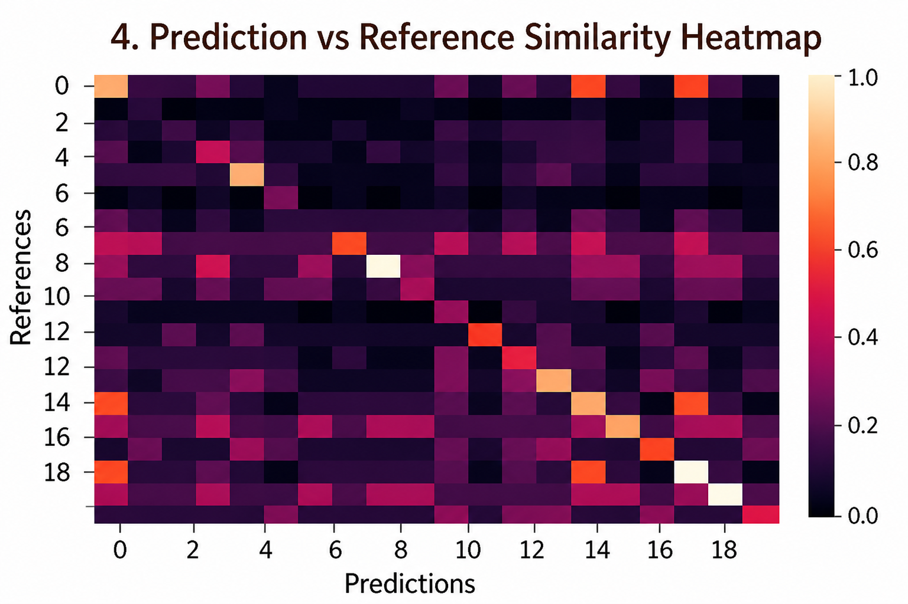

# Code Translation using Transformer Models: Java ↔ C#

A transformer-based code translation project for converting **Java code to C#** using **CodeBERT** and the **CodeXGLUE Java-C# dataset**, along with evaluation, visualization, and a Django-based demo interface.

---
> 🚀 Java → C# Code Translation using Transformer Models (CodeBERT)

## Table of Contents

- [Project Overview](#project-overview)
- [Motivation](#motivation)
- [Objectives](#objectives)
- [Dataset](#dataset)
- [Methodology](#methodology)
- [Model Architecture](#model-architecture)
- [Results](#results)
- [Visualizations](#visualizations)
- [Django Demo](#django-demo)
- [Project Structure](#project-structure)
- [Installation](#installation)
- [Run](#run)
- [Future Work](#future-work)
- [Author](#author)

---

## Project Overview

Automatic code translation is an important problem in **software engineering** and **NLP**. The goal is to translate code while preserving **logic, structure, and functionality**.

This project uses **CodeBERT** for **Java → C# translation**.

---

## Motivation

- Reduce manual coding effort  
- Minimize human errors  
- Help in system migration  
- Improve developer productivity  

---

## Objectives

- Study transformer-based models  
- Evaluate baseline CodeBERT  
- Fine-tune for translation task  
- Analyze results using metrics  
- Build a working demo  

---

## Dataset

**CodeXGLUE Java-C# dataset**

| Split | Samples |
|------|--------:|
| Train | 10,295 |
| Validation | 499 |
| Test | 1,000 |

---

## Methodology

### 1. Data Loading
- Load parallel Java–C# code pairs  

### 2. Preprocessing
- Tokenization using CodeBERT  
- Padding and truncation  

### 3. Baseline
- Evaluate pre-trained model  

### 4. Fine-tuning
- Train CodeBERT with decoder  

### 5. Evaluation
- BLEU  
- ROUGE-L  
- Exact Match  

### 6. Deployment
- Django integration  

---

## Model Architecture

- **Encoder**: CodeBERT (pre-trained on programming languages)  
- **Decoder**: Transformer-based sequence generator  
- **Inference**: Beam Search decoding  

### Pipeline




---

## Results

### Quantitative Evaluation

| Model        | BLEU ↑ | ROUGE-L ↑ | Exact Match ↑ |
|-------------|--------:|----------:|---------------:|
| Baseline    | 6.11    | 0.12      | 1.8%           |
| Fine-tuned  | 34.59   | 0.678     | 21.84%         |

### Metrics Explanation

- **BLEU**: Measures n-gram overlap between generated and reference code  
- **ROUGE-L**: Captures longest common subsequence (structure similarity)  
- **Exact Match**: Percentage of outputs identical to ground truth  

### Observations

- Baseline performs poorly → not trained for generation  
- Fine-tuning improves translation quality significantly  
- Model learns:
  - Syntax mapping (Java → C#)
  - Variable naming patterns
  - Structural transformations  

---

## Visualizations

### BLEU Score Comparison


### Function Length Distribution


### Prediction vs Reference Similarity


---

## Django Demo

A web-based interface for real-time code translation.

### Features

- Paste Java code into input box  
- Click **Translate**  
- Get generated C# output instantly    

---

## Project Structure
````md
CodeTranslationProject/
├── code_translator/      # Django web app
├── data/                 # Dataset files
├── evaluation/           # Graphs & visualizations
├── saved_models/         # Fine-tuned checkpoints
├── run.py                # Training & testing script
├── model.py              # Model definition
├── translator.py         # Helper utilities
├── requirements.txt
└── README.md
````


---

## Installation

```bash
git clone THE_REPO
cd CodeTranslationProject
python -m venv myenv
```

### Activate environment:
```bash
.\myenv\Scripts\activate
```

### Install dependencies:
```bash
pip install -r requirements.txt
```

## Run
```bash
python run.py
```

##Future Work

- Larger datasets
- Better models
- Improved UI
- Advanced evaluation

---

## Author

**Sagri Mohammed Umer**
IIT (BHU), Varanasi

---
